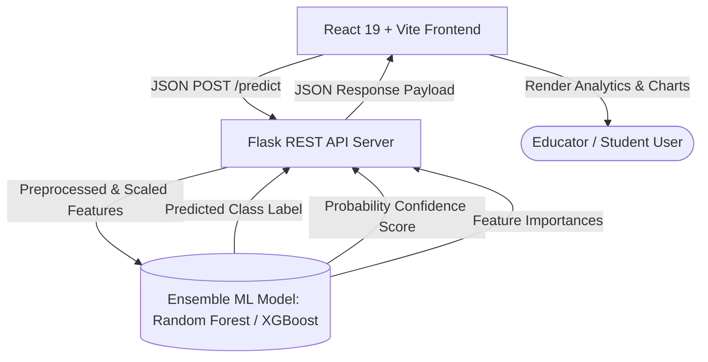
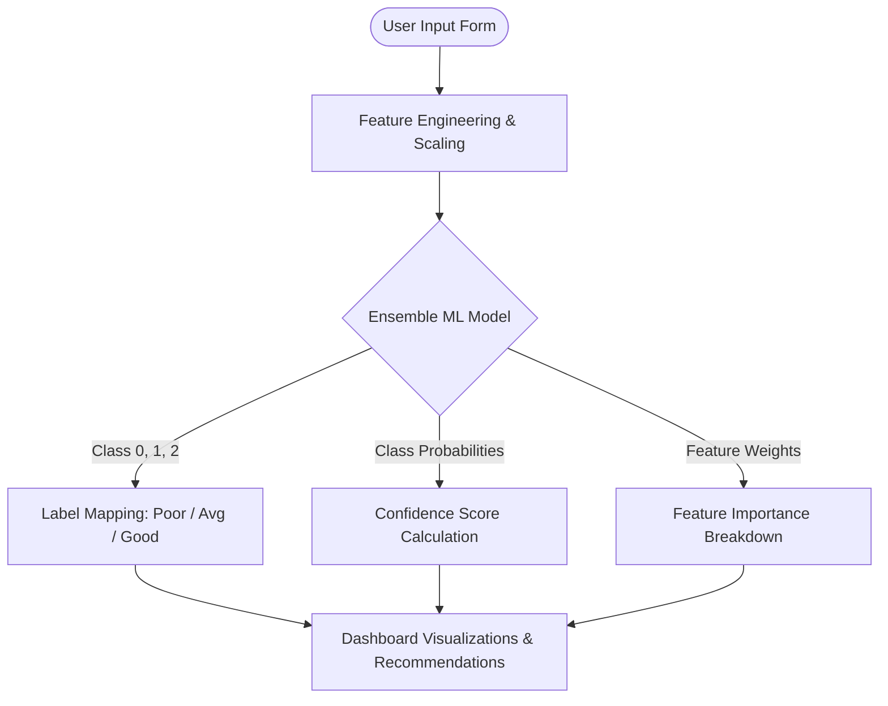

# 🎓 EduPredict — AI-Powered Student Performance Analytics & Prediction Platform

[](https://react.dev/)
[](https://vitejs.dev/)
[](https://tailwindcss.com/)
[](https://www.python.org/)
[](https://flask.palletsprojects.com/)
[](https://scikit-learn.org/)
[](https://xgboost.readthedocs.io/)
[](LICENSE)

**EduPredict** is an end-to-end Machine Learning web application designed to evaluate, predict, and analyze student academic performance. Powered by optimized ensemble ML algorithms (**Random Forest** & **XGBoost**) and a sleek **React + Vite** frontend, EduPredict empowers educators, students, and administrators to identify academic risk factors early and take data-driven interventions.

---

## 📑 Table of Contents

- [Overview](#-overview)
- [Key Features](#-key-features)
- [System Architecture](#-system-architecture)
- [Machine Learning Pipeline](#-machine-learning-pipeline)
- [Project Directory Structure](#-project-directory-structure)
- [Tech Stack](#-tech-stack)
- [Getting Started](#-getting-started)
  - [Prerequisites](#prerequisites)
  - [Backend Setup (Flask API)](#1-backend-setup-flask-api)
  - [Frontend Setup (React Dashboard)](#2-frontend-setup-react-dashboard)
  - [Model Training & Retuning](#3-model-training--retuning-optional)
- [API Reference](#-api-reference)
- [Documentation & Reports](#-documentation--reports)
- [License](#-license)

---

## 🧠 Overview

EduPredict processes key academic, behavioral, and demographic features (such as attendance percentage, internal test scores, backlogs, study hours, extra-curricular involvement, and educational support) to forecast a student's final grade performance band:

- 🟢 **Good Performance** (Final Grade $\ge 14 / 20$)
- 🟡 **Average Performance** (Final Grade $10 - 13 / 20$)
- 🔴 **Poor Performance / At Risk** (Final Grade $< 10 / 20$)

In addition to classification, the platform returns a **confidence probability score** and a **feature importance decomposition**, giving users clear insights into *why* a particular prediction was made.

---

## ✨ Key Features

- 🤖 **Ensemble Machine Learning**: Trained and fine-tuned using `GridSearchCV` on the UCI Student Performance dataset.
- ⚡ **Real-Time Predictions**: Instant Flask REST API inference with scaled input features (`StandardScaler`).
- 📊 **Interactive Analytics Dashboard**: Dynamic chart visualizations using Chart.js (Radar charts, Doughnut charts, and Feature Importance breakdowns).
- 💬 **Integrated AI Counseling Chatbot**: Embedded assistant providing academic advice and intervention recommendations based on prediction outcomes.
- 📂 **Student Directory & Management**: Filterable student records with individual performance indicators and risk status.
- 💾 **Session History**: Persisted prediction records stored securely in user browser `localStorage`.
- 🌓 **Dark & Light Mode**: Fluid dark theme toggle with modern glassmorphism aesthetics.

---

## 🏗️ System Architecture



### Data Flow Pipeline



---

## 🔬 Machine Learning Pipeline

### 1. Dataset
Trained on the **UCI Student Performance Dataset** (`student-mat.csv`), containing student achievement in secondary education of two Portuguese schools.

### 2. Feature Engineering
The model transforms raw indicators into actionable academic metrics:
- **`attendance`**: Calculated as `100 - absences`
- **`internal_avg`**: Mean of internal evaluation terms `(G1 + G2) / 2`
- **`backlogs`**: Total number of course failures (`failures`)
- **`studytime`**: Weekly study hours (scale 1–4)
- **`schoolsup`**: Binary encoding of extra educational support
- **`activities`**: Binary encoding of extra-curricular activities participation
- **`higher`**: Binary encoding of higher education pursuit intention

### 3. Hyperparameter Tuning & Model Selection
Grid search CV was conducted across hyperparameter grids for both **Random Forest Classifier** and **XGBoost Classifier**:

| Metric | Random Forest (Tuned) | XGBoost (Tuned) |
| :--- | :---: | :---: |
| **Accuracy** | **~88.6%** | ~86.1% |
| **Weighted F1-Score** | **~0.88** | ~0.85 |
| **5-Fold CV Score** | **~0.87** | ~0.84 |

---

## 📁 Project Directory Structure

```
student-performance/
├── architecture.md                        # Architecture overview & Mermaid diagrams
├── EduPredict_Project_Walkthrough.html    # Interactive project walkthrough documentation
├── EduPredict_Technical_Report.html       # Full technical report HTML
├── generate_html.py                       # Script to build standalone technical reports
├── student-mat.csv                        # UCI dataset file
├── student_performance_model.py           # Baseline model training script
├── student_performance_tuned_model.py     # Hyperparameter tuning script (GridSearchCV)
│
├── student-performance-api/               # Backend Flask REST API
│   ├── app.py                             # API server endpoints & model loader
│   ├── final_student_model.pkl            # Trained Scikit-Learn / XGBoost model artifact
│   ├── scaler.pkl                         # Trained StandardScaler artifact
│   └── requirements.txt                   # Python package dependencies
│
└── student-performance-frontend/          # React 19 + Vite Frontend
    ├── package.json                       # Node.js dependencies & build scripts
    ├── vite.config.js                     # Vite configuration
    ├── tailwind.config.js                 # Tailwind CSS v4 setup
    ├── public/                            # Static assets
    └── src/
        ├── App.jsx                        # Main Application container & layout
        ├── components/                    # UI components (PredictionForm, ResultDisplay, etc.)
        └── lib/                           # Utility helpers
```

---

## 🛠️ Tech Stack

### **Frontend**
- **Framework**: [React 19](https://react.dev/) + [Vite 7](https://vitejs.dev/)
- **Styling**: [Tailwind CSS v4](https://tailwindcss.com/)
- **Animations**: [Framer Motion](https://www.framer.com/motion/)
- **Charts & Data Viz**: [Chart.js](https://www.chartjs.org/) & [react-chartjs-2](https://react-chartjs-2.js.org/)
- **Icons**: [Lucide React](https://lucide.dev/)
- **Notifications**: [React Hot Toast](https://react-hot-toast.com/)

### **Backend & API**
- **Server**: [Flask](https://flask.palletsprojects.com/) + [Flask-CORS](https://flask-cors.readthedocs.io/)
- **Production Server**: [Gunicorn](https://gunicorn.org/)
- **Serialization**: [Joblib](https://joblib.readthedocs.io/)

### **Machine Learning & Data Science**
- **Languages**: Python 3.9+
- **Core Libraries**: `scikit-learn`, `xgboost`, `pandas`, `numpy`

---

## 🚀 Getting Started

### Prerequisites

Ensure you have the following installed on your local machine:
- **Python** (v3.9 or higher)
- **Node.js** (v18.0 or higher) & **npm**

---

### 1. Backend Setup (Flask API)

1. Navigate to the API directory:
   ```bash
   cd student-performance-api
   ```

2. Create and activate a virtual environment:
   - **Windows**:
     ```bash
     python -m venv venv
     venv\Scripts\activate
     ```
   - **macOS / Linux**:
     ```bash
     python3 -m venv venv
     source venv/bin/activate
     ```

3. Install required Python packages:
   ```bash
   pip install -r requirements.txt
   ```

4. Run the Flask server:
   ```bash
   python app.py
   ```
   The API will start at `http://localhost:5000`.

---

### 2. Frontend Setup (React Dashboard)

1. Open a new terminal and navigate to the frontend directory:
   ```bash
   cd student-performance-frontend
   ```

2. Install dependencies:
   ```bash
   npm install
   ```

3. Start the Vite development server:
   ```bash
   npm run dev
   ```
   Open your browser and navigate to `http://localhost:5173`.

---

### 3. Model Training & Retuning (Optional)

If you wish to re-train the models from scratch or tweak hyperparameter search spaces:

1. Place `student-mat.csv` in the root folder.
2. Run the tuning script:
   ```bash
   python student_performance_tuned_model.py
   ```
3. Copy the generated `final_student_model.pkl` and `scaler.pkl` to `student-performance-api/`.

---

## 🔌 API Reference

### `POST /predict`

Sends student parameters for model inference.

#### Request Headers
`Content-Type: application/json`

#### Request Body
```json
{
  "attendance": 92,
  "internal_avg": 14.5,
  "studytime": 3,
  "backlogs": 0,
  "schoolsup": 0,
  "activities": 1,
  "higher": 1
}
```

#### Response (200 OK)
```json
{
  "prediction": 2,
  "performance": "Good Performance",
  "confidence": 0.91,
  "feature_importance": {
    "attendance": 0.284,
    "internal_avg": 0.412,
    "studytime": 0.115,
    "backlogs": 0.098,
    "schoolsup": 0.031,
    "activities": 0.024,
    "higher": 0.036
  }
}
```

---

### `GET /`

API health check endpoint.

#### Response (200 OK)
```text
Student Performance Prediction API is running
```

---

## 📄 Documentation & Reports

The repository includes pre-built interactive HTML documentation for in-depth technical analysis and architecture review:

- 📊 **[EduPredict Technical Report](EduPredict_Technical_Report.html)**: Detailed evaluation metrics, confusion matrices, and feature importance analyses.
- 🗺️ **[EduPredict Project Walkthrough](EduPredict_Project_Walkthrough.html)**: Step-by-step user guide and feature walkthrough.
- 📐 **[Architecture Specification](architecture.md)**: Visual diagrams of system components and data flow pipelines.

---

## 📜 License

This project is open-source and available under the [MIT License](LICENSE).

---

<p align="center">
  Made with ❤️ for Data-Driven Education
</p>
