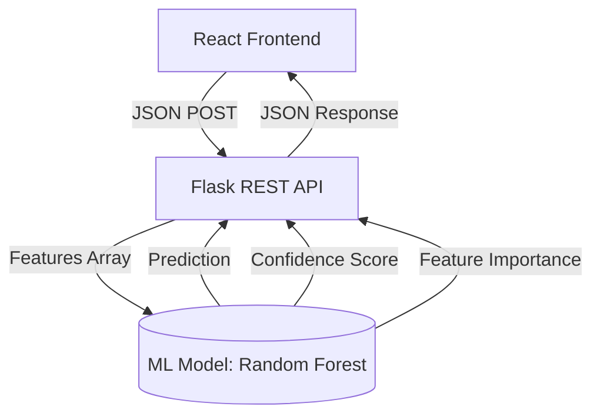
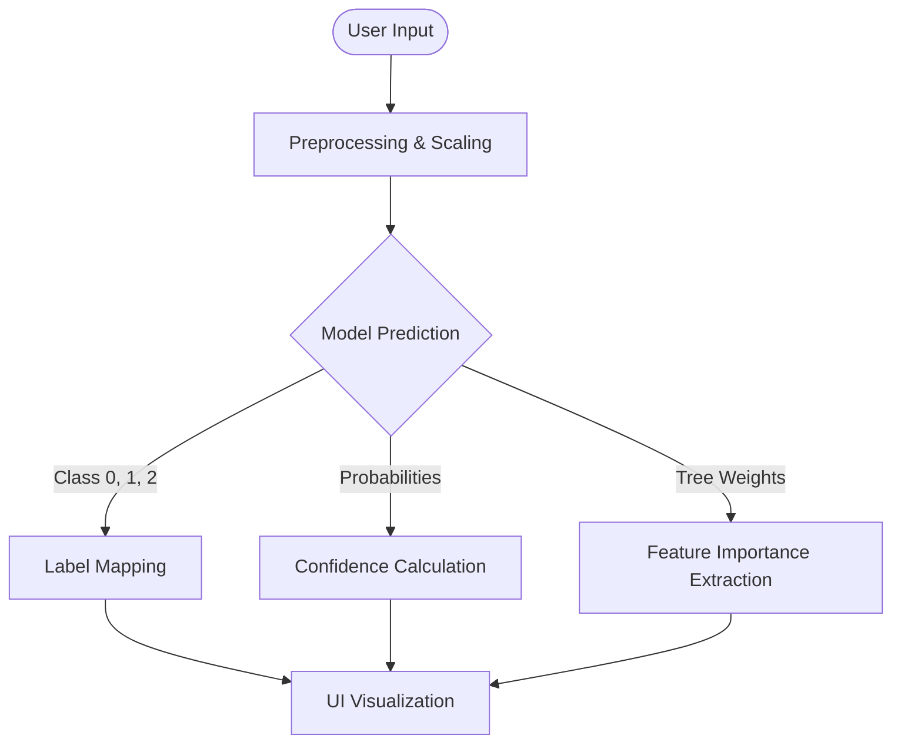

# Student Performance AI — Architecture

## Architecture Diagram

```mermaid
graph TD
    UI[React Frontend] -->|JSON POST| API[Flask REST API]
    API -->|Features Array| ML[(ML Model: Random Forest)]
    ML -->|Prediction| API
    ML -->|Confidence Score| API
    ML -->|Feature Importance| API
    API -->|JSON Response| UI
```

---

## Data Flow Diagram

```mermaid
flowchart TD
    A([User Input]) --> B[Preprocessing & Scaling]
    B --> C{Model Prediction}
    C -->|Class 0, 1, 2| D[Label Mapping]
    C -->|Probabilities| E[Confidence Calculation]
    C -->|Tree Weights| F[Feature Importance Extraction]
    
    D --> G[UI Visualization]
    E --> G
    F --> G
```
